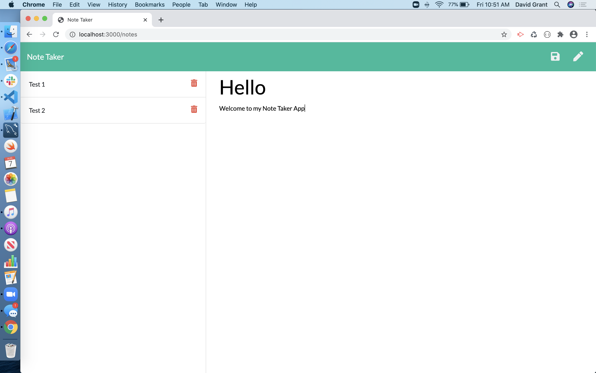

# Note-Taker---Assignment-9

Created a web application that allows a user to add notes and delete them. 

I incurred a challegne of understanding the new jargon for express. specifically using the app. methods was a challenge. Through utilizing my cohort and tutors i was able to better understand what it means to deposit to the req and also the use of filter.

